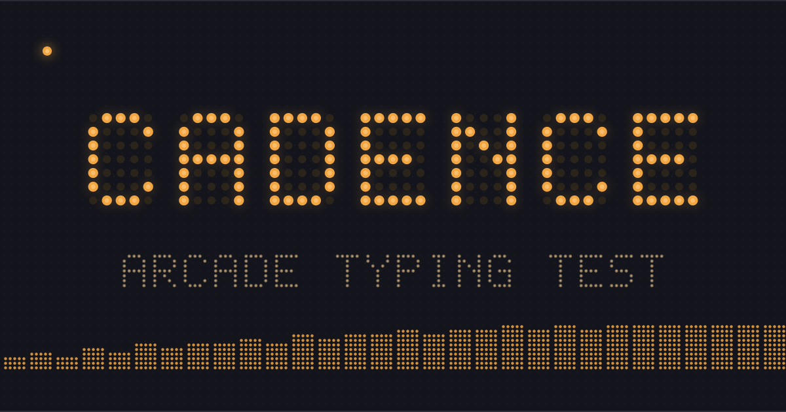

# Cadence

Cadence is an original arcade-style typing test app for measuring typing speed, accuracy, and consistency in the browser. It is built as a static web app, so it can run from a simple HTML file or any static hosting provider.



## Live App

https://parzival92.github.io/cadence/

## What It Does

Cadence gives users a focused typing test with real-time feedback and a results screen at the end of each run.

Core functionality:

- Timed typing tests
- Fixed-word typing tests
- Easy, medium, and hard difficulty levels
- Live WPM display
- Live accuracy display
- Progress counter
- Character-level feedback while typing
- Restart and replay flow
- Local personal-best tracking per mode, length, and difficulty (stored in the browser, no accounts)
- Final result summary
- Raw WPM and net WPM
- Accuracy percentage
- Character breakdown
- Desktop keyboard support
- Mobile tap-to-type support
- Static-site deployment support

## Scoring

Cadence uses the standard typing-test convention where one word equals five characters.

- **Raw WPM** measures total typed characters per minute.
- **Net WPM** measures speed after accounting for typing errors.
- **Accuracy** measures correct typed characters as a percentage of typed characters.
- **Character breakdown** separates correct, incorrect, extra, and missed characters.

This makes results easy to compare across different test lengths and modes.

## Controls

- Start typing: click or tap the test area, then type
- Next word: `Space`
- Restart: `Esc`
- Change mode: select `TIME` or `WORDS`
- Change duration: select `15`, `30`, `60`, or `120`
- Change difficulty: select `EASY`, `MED`, or `HARD`

## Run Locally

Open `index.html` in a browser.

```bash
open index.html
```

No build step is required. React and ReactDOM are vendored in `vendor/`, so the app boots fully offline — no CDN access needed. (The Google Fonts stylesheet is still fetched when online; the app falls back to the system monospace font without it.)

## Run Tests

Scoring, word generation, and personal-best rules live in `src/` and are covered by unit tests, alongside launch smoke tests that verify the vendored runtime and page wiring. With Node.js 18+ installed:

```bash
node --test
```

No test dependencies are required; the suite uses Node's built-in test runner. The same suite runs in CI on every push and pull request.

## QA

The launch QA workflow — automated checks plus the manual browser checklist for desktop and mobile — is documented in [docs/QA.md](docs/QA.md). `qa-harness.html` shows the app at common mobile widths side by side.

## Deploy

Cadence is a static site. It can be deployed from the repository root.

Supported deployment targets include:

- GitHub Pages
- Netlify
- Vercel
- Cloudflare Pages
- Any static file server

For GitHub Pages, publish the `main` branch from the repository root.

## Project Structure

```text
.
├── index.html
├── support.js
├── qa-harness.html
├── src/
│   ├── scoring.js
│   ├── words.js
│   └── personalbest.js
├── tests/
│   ├── scoring.test.js
│   ├── words.test.js
│   ├── personalbest.test.js
│   └── smoke.test.js
├── .github/
│   └── workflows/
│       └── ci.yml
├── assets/
│   ├── preview.png
│   ├── favicon.svg
│   ├── favicon-32.png
│   └── apple-touch-icon.png
├── vendor/
│   ├── react.production.min.js
│   └── react-dom.production.min.js
├── docs/
│   ├── PRD.md
│   └── QA.md
├── .nojekyll
├── .gitignore
└── README.md
```

## Technical Notes

- The app currently ships as a static browser app.
- The UI and interaction logic are contained in `index.html`.
- Runtime support code is contained in `support.js`.
- Scoring rules live in `src/scoring.js`, word generation in `src/words.js`, and personal-best persistence in `src/personalbest.js` (localStorage key `cadence.pb.v1`). Each loads as a browser global (`CadenceScoring` / `CadenceWords` / `CadencePB`) or CommonJS for tests. The UI in `index.html` uses these modules directly; there are no inline copies.
- `.nojekyll` is included so GitHub Pages serves all static files directly.
- Launch metadata (title, description, Open Graph, and Twitter card tags) lives in the static `<head>` of `index.html` so crawlers and link previews see it without running JavaScript. Favicon and preview assets live in `assets/`.
- React and ReactDOM (18.3.1 UMD builds) are vendored in `vendor/` and loaded before `support.js`, which skips its `unpkg.com` fallback when they are already present. The vendored files match the SRI hashes pinned in `support.js`.
- Babel is only fetched by the runtime for external JSX imports (`x-import`), which Cadence does not use, so it is never loaded.

## Product Direction

The immediate goal is to make Cadence a reliable public typing-test app with a polished single-player experience.

Planned improvements:

- Quote mode (deferred from v1; see issue #11 for scope guardrails)

## Documentation

- Product requirements: [docs/PRD.md](docs/PRD.md)
- Launch QA workflow: [docs/QA.md](docs/QA.md)

## License

No license has been selected yet.
